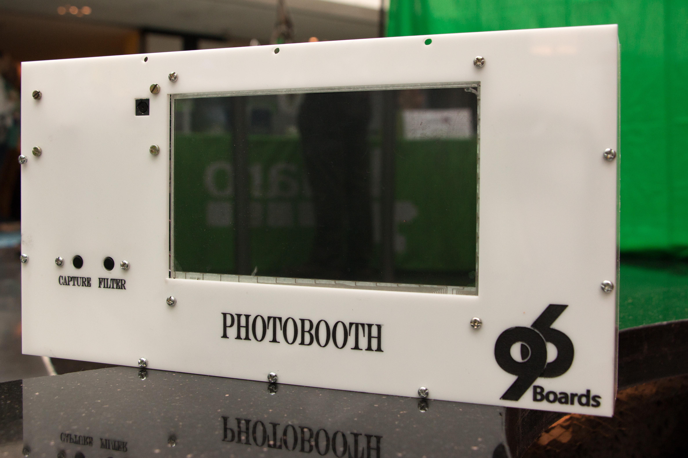
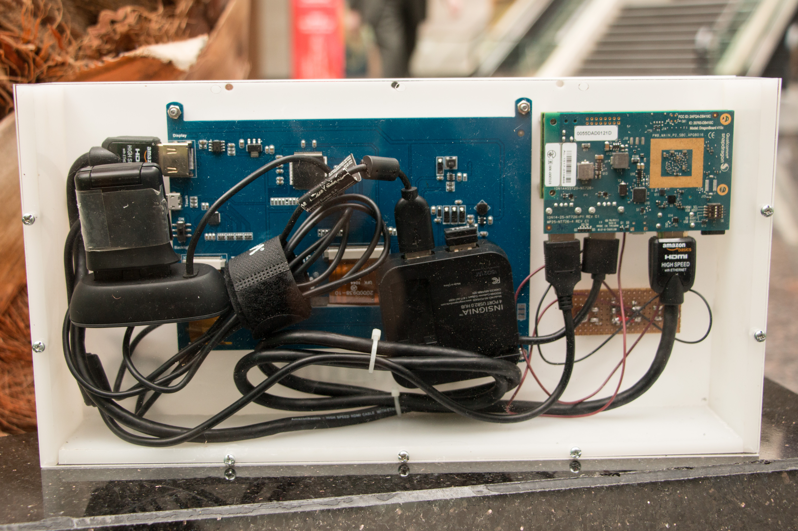

# Photobooth

This repository consists of instructions to set up a Photobooth using
96Boards CE.

## Table of Contents
- [1) Hardware](#1-hardware)
   - [1.1) Hardware Requirements](#11-hardware-requirements)
- [2) Software Setup](#2-software-setup)
   - [2.1) Setting up MRAA](#21-setting-up-mraa)
   - [2.2) Setting up OpenCV](#22-setting-up-opencv)
   - [2.3) Setting up AWS S3](#23-setting-up-aws-s3)
- [3) Hardware Setup](#3-hardware-setup)
- [4) 96Boards Photobooth](#4-96boards-photobooth)
- [5) Video Demonstration](#5-video-demonstration)

## 1) Hardware

### 1.1) Hardware Requirements

- [Dragonboard410c](https://www.96boards.org/product/dragonboard410c/)
- [96Boards Compliant Power Supply](http://www.96boards.org/product/power/)
- [D3 Mezzanine with OV5640 Camera Sensor](https://www.96boards.org/product/d3camera/)
- [Push Buttons](https://www.seeedstudio.com/Grove-Button-p-766.html)
- Connecting Wires

## 2) Software Setup

> Note: All of the instructions needs to be carried out in Dragonboard410c.

Flash Boot and Root file system images using the instructions provided in
[D3 Enginerring WiKi](https://github.com/D3Engineering/410c_camera_support/wiki/D3-Camera-Mezzanine-User-Guide).

### 2.1) Setting up MRAA

Install MRAA from source using the instructions provided in MRAA
[documentation page](https://github.com/96boards/documentation/blob/master/consumer/guides/mraa/install.md).

### 2.2) Setting up OpenCV

Setup OpenCV using the instructions provided in [Projects Org](https://github.com/96boards-projects/home_surveillance/tree/master/part-2#2-software),
just follow it for installing OpenCV. Only change required is to replace the
cmake command with below one:

```shell
$ cmake -D CMAKE_BUILD_TYPE=RELEASE -DWITH_LIBV4L=ON -DWITH_GSTREAMER=ON -DWITH_OPENCL=ON -DBUILD_EXAMPLES=OFF -DBUILD_opencv_apps=OFF -DBUILD_DOCS=OFF -DBUILD_PERF_TESTS=OFF -DBUILD_TESTS=OFF -DCMAKE_INSTALL_PREFIX=/usr/local -DENABLE_PRECOMPILED_HEADERS=OFF -DOPENCV_EXTRA_MODULES_PATH=<opencv_contrib>/modules ../
```

### 2.3) Setting up AWS S3

Setup AWS S3 bucket and Boto SDK using the instructions provided in
[Projects Org](https://github.com/96boards-projects/home_surveillance/tree/master/part-4#2-software).

In addition to the above packages, install below libraries:

```shell
$ sudo apt-get update
$ sudo apt-get install python3
$ sudo apt-get install python3-pip
$ sudo pip3 install pillow
$ sudo apt-get install qrencode
```

* Install [Pyshortener](https://pypi.python.org/pypi/pyshorteners)

## 3) Hardware Setup

1. Make sure Dragonboard410c is turned off
2. Connect OV5640 to D3 Camera Mezzanine
3. Place D3 Camera Mezzanine on top of Dragonboard
4. Connect Linksprite LCD screen to Dragonboard
5. Connect Capture Push button to Pin 12 of J5 connector on Camera Mezzanine
6. Connect Filter Push button to Pin 10 of J5 connector on Camera Mezzanine
7. Assemble the whole setup in a kit
8. Power on Dragonboard using compatible power supply

> Note: Push buttons needs to be connected in Pull down mode.




> Note: You can also use USB camera for this project. Just provide the correct
        video source in `photobooth.py`.

## 4) 96Boards Photobooth

After setting up all of the hardware and software mentioned above, follow the
below steps to execute photobooth.

Replace the default S3 Bucket URL with your own S3 URL in the `photobooth.py` script.

```shell
url = "https://s3-ap-southeast-1.amazonaws.com/96boards-photobooth/" + "final/user_" + str(count) + ".png"
```

> Note: By default, all the images will be pushed to the public `96boards-photobooth`
bucket created by 96Boards.

Now, clone the photobooth github repository.

```shell
$ git clone https://github.com/96boards-projects/photobooth.git
```

Finally, execute the photobooth as below:

```shell
$ mkdir captured final
$ ./init.sh
$ sudo python3 photobooth.py
```

* For changing the filter, press `Filter` button
* For capturing the image, press `Capture` button

After capturing the image, it will be uploaded to the S3 bucket with 96Boards
watermark and the tinyurl/qrcode will be displayed for 10 seconds.

## 5) [Video Demonstration](https://www.youtube.com/watch?v=Lksx6JpHOOU)

# References:

* https://github.com/lmacken/photobooth.py
* https://github.com/kunalgupta777/OpenCV-Face-Filters
